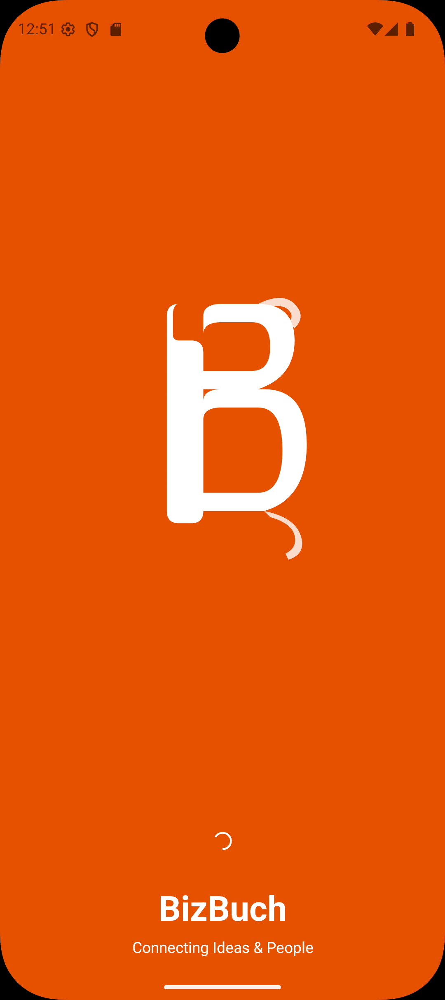
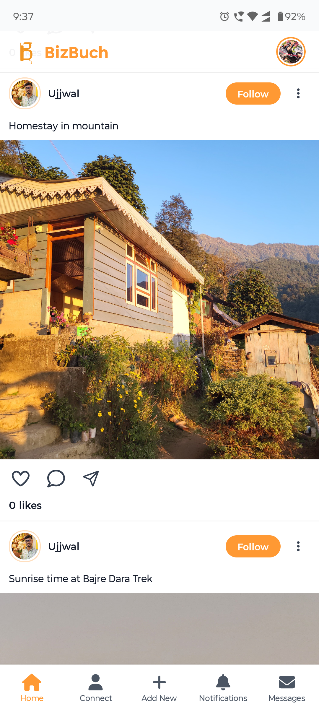
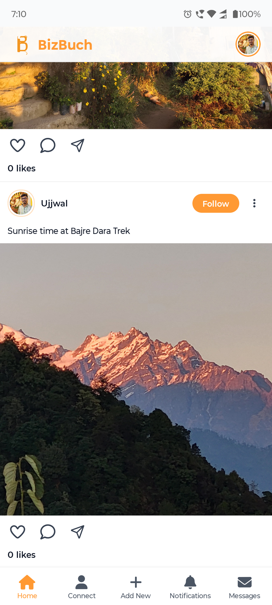
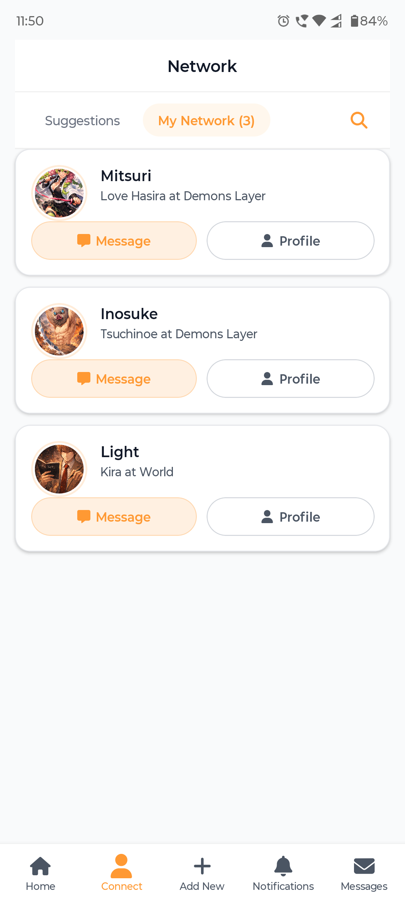

# BizBuch

  <b>Open-source social networking without monopoly.</b> 
  Self-hostable • Community-owned • Server-choice enabled

  
  
  
  
  
  
  

---

## 🚀 About

**BizBuch** is an open-source social networking application originally built to connect entrepreneurs.  
It has now evolved into a broader mission: **ending the monopoly of centralized social networking** by enabling anyone to host their own social network.

Unlike traditional social platforms where a single company owns the servers, data, rules, and reach — BizBuch can be deployed by **anyone** on a dedicated server (**on-prem** or **cloud**) to create independent community networks.

---

        

## ✨ Key Idea

Centralized social networks often mean:

- one company controls the infrastructure  
- one platform owns user data  
- one authority decides moderation policies  
- users are locked into the same network

BizBuch flips that model.

✅ **Self-host your own server**  
✅ **Communities control rules and identity**  
✅ **Users can choose which server to join**

---

## 🌍 Community Servers (Niche Networks)

BizBuch enables servers to be created around a niche or purpose, such as:

- 🌱 Environment & sustainability  
- 🎭 Culture, traditions & communities  
- ✈️ Travel and tourism groups  
- 🚀 Entrepreneurship & startups  
- 🏢 Companies / internal networks  
- 🏘️ Cities, local neighborhoods & communities  

Each deployment becomes its own independent social network — built and owned by the community running it.

---

## ⚙️ Advanced Setting (Coming Soon)

BizBuch will include an **Advanced Setting** screen *(coming soon)* where users can:

- Select the server they want to join  
- Connect to that server's community network  
- Switch servers based on interest, region, or purpose  

This enables a decentralized-style experience:
> **One app, many communities, user choice.**

---

## ✅ Project Goals

- Provide a self-hostable social networking platform  
- Reduce dependency on centralized social monopolies  
- Enable niche and community-owned networks  
- Support server selection across deployments  

---

## 🧩 Contributing

Contributions are welcome!  
If you’d like to improve BizBuch, feel free to:

- open issues for bugs / feature requests  
- submit pull requests  
- improve documentation

---

## 📄 License

This project is licensed under the **MIT License**.
See [`LICENSE`](./LICENSE) for details.

---

## ⭐ Support

If you like the project, consider giving it a ⭐ on GitHub — it helps the project grow!- 🎭 Culture, traditions & community networks
