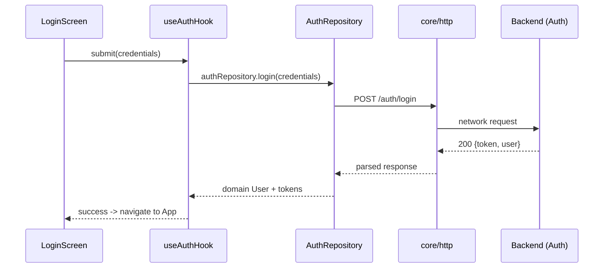
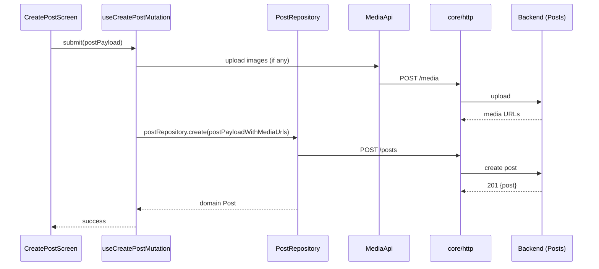
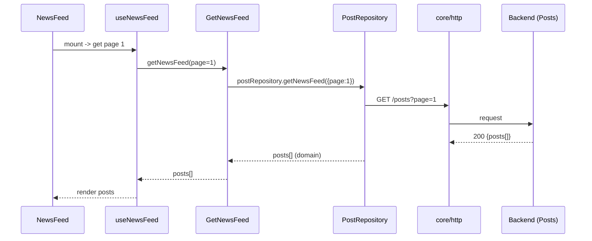

# BizBuch — Low Level Design (LLD)

Purpose
- Provide a developer-facing low-level design for the BizBuch React Native app.
- Describe modules, responsibilities, interfaces, data flows, and key sequences.

**Scope**: mobile client application only (presentation, domain, application, data layers, DI). Backend APIs are referenced but not implemented here.

**High-Level Architecture**
- Presentation (React Native screens, components, navigation)
- UI layer (hooks, query clients, form helpers)
- Domain (entities, repositories interfaces, use-cases)
- Application (handlers that orchestrate use-cases)
- Data (concrete repositories, API adapters, formatters)
- Core (http client, config)
- DI (shared instantiation of repositories and frequently used use-cases)

Key repo entry points:
- DI bindings: [src/ui/di.ts](src/ui/di.ts#L1-L200)
- App navigator: [src/presentation/navigation/AppNavigator.tsx](src/presentation/navigation/AppNavigator.tsx#L1-L120)
- Core config: [src/core/config.ts](src/core/config.ts#L1-L50)
- API spec (backend): [BizBuch API spec](BizBuch%20API.yaml)

**Module Responsibilities**
- Presentation
  - Screens under [src/presentation/screens](src/presentation/screens) render UI and call hooks/use-cases.
  - Navigation is split into `RootNavigator`, `AppNavigator`, and route-specific stacks.
- UI
  - `ui/hooks` contains React hooks that wire use-cases or repositories to components.
  - `ui/queryClient.ts` configures react-query for caching/fetching.
- Domain
  - `domain/*/entities` define the domain models (User, Post, Comment, Notification, Message, etc.).
  - `domain/*/repositories` declare repository interfaces (e.g., `IPostRepository`).
  - `domain/*/usecases` implement business rules as small classes/functions.
- Application
  - `application/*/handler` contains orchestrators that combine multiple use-cases or repository calls for background jobs or event handlers.
- Data
  - `data/repositories/*` implement repository interfaces using the `core/http` API and `services` formatters.
  - `data/services` encapsulate API payload transformations and media uploads.
- Core
  - `src/core/http.ts` is the HTTP wrapper used by repositories to call the backend.
  - `src/core/config.ts` defines API base URLs.

**Dependency Injection**
- Single-file DI: [src/ui/di.ts](src/ui/di.ts#L1-L200) exports:
  - Repository singletons: `authRepository`, `postRepository`, `connectionRepository`, `profileRepository`, `chatRepository`, `activityLogRepository`, `notificationRepository`, `commentRepository`.
  - Commonly used use-cases like `getNewsFeedUseCase`, `getNotificationsUseCase`.
- Repositories are typed by domain interfaces then implemented by concrete classes in `data/repositories`.

**Primary Interfaces & Example Types**
- Repository interface pattern (example):
  - `IPostRepository` (path: [src/domain/post/repositories/IPostRepository.ts](src/domain/post/repositories/IPostRepository.ts#L1-L200)) — defines methods like `getNewsFeed`, `create`, `getById`, `getComments`, `createComment`.
  - `IAuthRepository` — defines `login`, `register`, `refreshToken`, etc.

- Entities: folder-per-concept. Example:
  - `src/domain/post/entities` contains `Post` entity and DTOs.
  - `src/domain/user/entities` contains `Profile`/`User`.

**Data Flow & Patterns**
- UI -> Hook -> Use-case / Repository -> HTTP -> API -> Formatter -> Repository returns domain entities.
- Repositories return domain entities or throw domain-specific errors.
- Error handling: repositories map HTTP errors to domain error types; hooks and use-cases handle retries and user-friendly messages.
- Caching: react-query (configured in `ui/queryClient.ts`) is used for read-heavy data (newsfeed, profile, notifications).

**Sequence: Login Flow**

Mermaid sequence diagram:

**Sequence: Create Post**

**Sequence: Get Newsfeed**

**Chat / Realtime**
- Chat uses WebSocket URL from `src/core/config.ts` (`CHAT_WS_URL`) and a `ChatRepository` to connect/emit/subscribe.
- `ChatRepository` provides methods: `connect()`, `sendMessage()`, `subscribeToRoom()`.

**Key Files to Inspect**
- DI bindings: [src/ui/di.ts](src/ui/di.ts#L1-L200)
- Core config: [src/core/config.ts](src/core/config.ts#L1-L20)
- App navigator: [src/presentation/navigation/AppNavigator.tsx](src/presentation/navigation/AppNavigator.tsx#L1-L120)
- Example repository implementation: [src/data/repositories/PostRepository.ts](src/data/repositories/PostRepository.ts#L1-L300)
- Example use-case: [src/domain/post/usecases/queries/GetNewsFeed.ts](src/domain/post/usecases/queries/GetNewsFeed.ts#L1-L200)

**Error Handling & Retries**
- HTTP wrapper centralizes error parsing and retry/backoff for transient network errors.
- Domain-level errors are thrown as typed errors to enable UI to show structured messages.
- Use-cases catch recoverable errors and return Result-like objects or throw for global handlers.

**Testing Strategy**
- Unit tests for domain use-cases and application handlers under `__tests__` (example: `App.test.tsx`).
- Repository unit tests should mock `core/http` to assert request shapes and response mapping.
- E2E tests (optional) to validate auth/login, create-post, and chat flows on emulator.

**Performance & Offline Considerations**
- Use react-query cache + stale-while-revalidate for fast UI.
- For media uploads, perform background uploads with optimistic UI updates.
- Consider offline queueing for outgoing actions (posts/messages) if needed in future.

**Security**
- Store tokens securely using `react-native-keychain` or equivalent.
- Always use HTTPS for API and WSS for websockets in production (config is currently local IP URLs in `src/core/config.ts`).

**Deployment / CI**
- Standard RN build pipelines for iOS/Android.
- Keep `BizBuch API.yaml` updated for API contract changes.

**Next Steps / Extensions**
- Add sequence diagrams for notifications and profile updates.
- Add more file-level references to important formatters and handlers in `application` and `data/services`.

---
Generated by developer-assistant for internal engineering use. Update and iterate as API/implementation changes.
